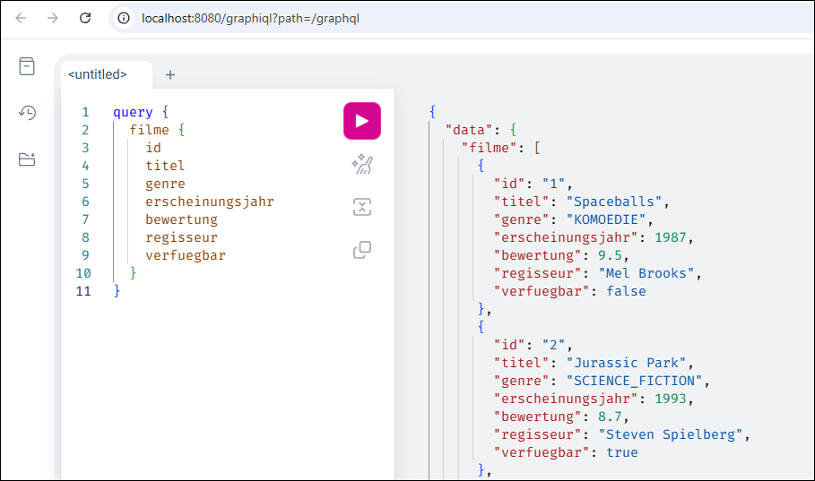

# Spring Boot: Filmdatenbank mit GraphQL #

<br>

Diese Repo enthält ein Maven-Projekt mit einer Spring-Boot-Anwendung, die eine Tabelle mit Filmen
über eine GraphQL-API bereitstellt.

<br>



<br>

----

## GraphQL-Queries ##

<br>

Wenn die Anwendung lokal ausgeführt wird, dann ist unter der folgenden URL der Web-Client GraphiQL verfügbar:
http://localhost:8080/graphiql

<br>

Liste aller Filme mit allen Attributen:
```
query {
  filme {
    id
    titel
    genre
    erscheinungsjahr
    bewertung
    regisseur
    verfuegbar
  }
}
```

<br>

Liste aller Filme mit Sortierung nach Titel:

```
query {
  filme( sortBy: ERSCHEINUNGSJAHR, direction: ASC ) {
    id
    titel
    erscheinungsjahr
  }
}
```

<br>

Einige Attribute für Film mit ID=1 abfragen:
```
query {
  filmById( id: "1" ) {
    id
    titel
    genre
  }
}
```

<br>

Name und Erscheinungsjahr für alle Science-Fiction-Filme zurückliefern:

```
query {
  filmeNachGenre( genre: SCIENCE_FICTION ) {
    titel
    erscheinungsjahr
  }
}
```

<br>

Einen neuen Film anlegen:
```
mutation {
  filmAnlegen(
    titel           : "Ziemlich beste Freunde"
    genre           : KOMOEDIE
    erscheinungsjahr: 2011
    bewertung       : 8.5
    regisseur       : "Olivier Nakache & Éric Toledano"
    verfuegbar      : true
  ) {
        id
        titel
        genre
        erscheinungsjahr
        bewertung
        regisseur
        verfuegbar
  }
}
```

<br>

Bewertung von Film mit ID=1 ändern:
```
mutation {
  filmBewertungAktualisieren( id: "1", bewertung: 9.9 ) {
    id
    titel
    bewertung
  }
}
```

<br>

Verfügbarkeit von Film mit ID=1 ändern:
```
mutation {
  filmVerfuegbarkeitAktualisieren( id: "1", verfuegbar: true ) {
    id
    titel
    verfuegbar
  }
}
```

<br>

Film mit ID=6 löschen:
```
mutation {
  filmLoeschen( id: "6" )
}
```

<br>

Laufende Änderungen per Subscription beobachten:
```
subscription {
  filmAenderungen {
    filmId
    art
    zeitpunkt
    film {
      titel
      genre
      verfuegbar
    }
  }
}
```

<br>

----

## License ##

<br>

See the [LICENSE file](LICENSE.md) for license rights and limitations (BSD 3-Clause License).

<br>
